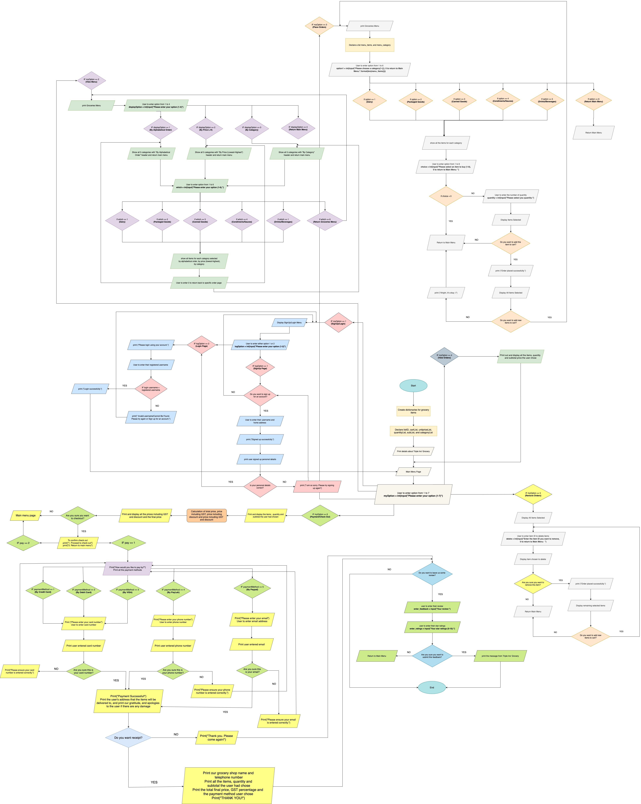

# EGC151 Project (Triple-Ins-Grocery)

## Objectives of Program
* To create a more user-friendly and responsive online ordering and payment system for the users.
* Allow customers to order their groceries online rather than physically going to the supermarket.
* Create brand awareness
* Assist people who have difficulties leaving their home.

## Program Requirements
* View menu items according to Alphabetical, Price, Category Order
* Shows respective items in category with prices when user select a category.
* Specifying the quantity order user wants to buy.
* Allow user to select multiple grocery items from various categories and add them to cart.
* Able to remove existing items.
* Prompting user if they have discount card
* If yes, 10% discount off the total ordered amount.
* Presented a formatted bill (total price, total discount, gst and final payable) with summary of all ordered items and prices

## FlowChart Diagram

